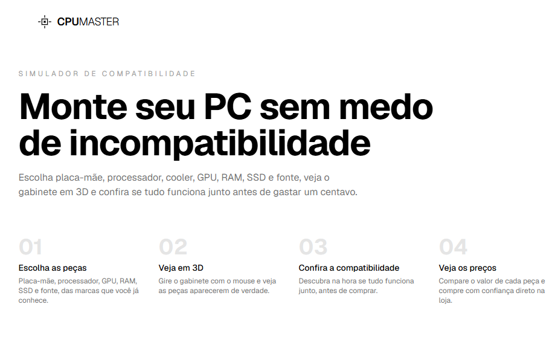
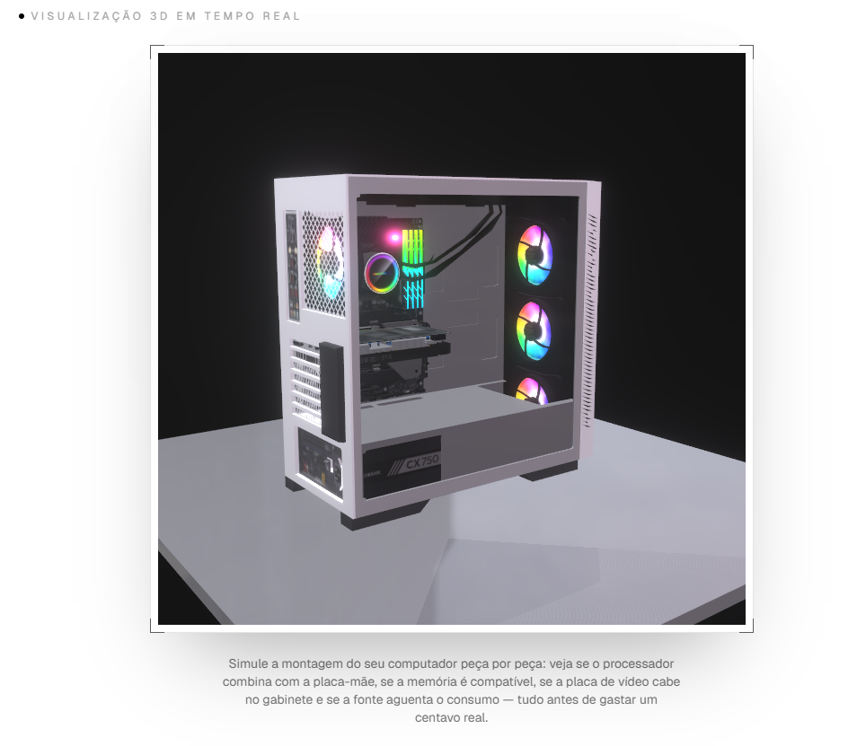

# 🖥️ CPU Master — Monte seu PC sem medo de incompatibilidade

Simulador de montagem de PC com checagem de compatibilidade em tempo real e visualização 3D do gabinete.


[Acesse o site em produção →](https://cpu-master-steel.vercel.app) — não precisa de cadastro, é só escolher as peças.

## Screenshots

| Tela inicial | Gabinete em 3D |
|---|---|
|  |  |

## Sobre

Montar um PC do zero é fácil de errar: processador que não encaixa na placa-mãe escolhida, memória do tipo errado, fonte fraca demais pra GPU. O CPU Master resolve isso montando a build inteira na tela e checando cada combinação de peça em tempo real, antes de qualquer compra de verdade.

## Por que fiz

Sempre gostei de montar PC e queria juntar isso com programação num projeto de verdade, não só um CRUD. Aproveitei também pra aprender React Three Fiber do zero (nunca tinha mexido com 3D na web) e pra treinar animação controlada por scroll usando só CSS puro, sem nenhuma lib de animação.

## Funcionalidades

- Seleção de placa-mãe, processador, cooler, GPU, RAM, SSD e fonte, com busca dentro de cada dropdown
- Checagem de compatibilidade em tempo real: soquete, tipo de memória, tamanho da GPU no gabinete, radiador do cooler, slot M.2 e consumo total x capacidade da fonte
- Aviso de gargalo quando processador e GPU estão muito desequilibrados
- Estimativa de FPS em jogos populares (1080p/1440p/4K), baseada no tier do processador e da GPU
- Gabinete em 3D navegável com o mouse, com as peças aparecendo conforme a seleção
- Seção de montagem completa em 3D controlada por scroll (CSS puro, sem lib de 3D)
- Builds prontas (custo-benefício, gamer, extremo) aplicadas com um clique
- Preço estimado de cada peça com link direto pra Kabum e Amazon
- Compartilhamento da configuração montada por link

## Stack

- **Frontend:** Next.js 16 (App Router) + React 19 + TypeScript + Tailwind CSS 4
- **3D:** React Three Fiber + drei + postprocessing (Bloom), com fallback de baixa qualidade pra celular
- **Testes:** Vitest, cobrindo o motor de compatibilidade e o estimador de FPS
- **CI/CD:** GitHub Actions rodando lint + testes + build a cada push
- **Deploy:** Vercel, com Analytics ligado

## Arquitetura

```
CpuMaster/
├── app/
│   ├── page.tsx          # página única, monta todas as seções
│   ├── layout.tsx        # metadata, fonte, Analytics
│   ├── robots.ts         # robots.txt
│   └── sitemap.ts        # sitemap.xml
├── components/
│   ├── pc-case-viewer.tsx     # canvas 3D (react-three-fiber)
│   ├── build-selector.tsx     # selects + compatibilidade + presets
│   ├── build-scroll-section.tsx  # montagem 3D em CSS puro no scroll
│   ├── featured-builds.tsx    # builds prontas
│   ├── price-section.tsx      # preços e links de loja
│   └── fps-estimator.tsx      # estimativa de FPS
├── lib/
│   ├── parts.ts           # catálogo de peças (tipos + dados)
│   ├── compatibility.ts   # motor de checagem de compatibilidade
│   ├── compatibility.test.ts
│   ├── fps.ts              # cálculo de FPS estimado
│   └── fps.test.ts
└── .github/workflows/ci.yml
```

Projeto sem backend nem banco de dados — o catálogo de peças e as regras de compatibilidade vivem em `lib/parts.ts` e `lib/compatibility.ts`, tudo roda no cliente.

## Rodando localmente

```bash
git clone https://github.com/Pedroaruana/CPU-MASTER.git
cd CPU-MASTER
npm install
npm run dev        # localhost:3000
```

Outros comandos:

```bash
npm run build   # build de produção
npm run lint    # eslint
npm test        # testes automatizados (Vitest)
```

## Desafios

**Montagem 3D sem nenhuma lib** — não usei three.js nem nada pra essa parte do scroll, só CSS mesmo: `perspective`, `preserve-3d`, `rotateX/rotateY`. O trabalho foi acertar a ordem das camadas (motherboard, cooler, RAM, GPU, vidro) pra uma peça não atravessar a outra — fiquei um tempão só brincando com `translateZ` até parar de parecer que a GPU tava flutuando dentro da placa-mãe.

**Bug bobo que só quebrou depois de já ter subido** — passei `cx="105"` como texto num componente que esperava número, no SVG da GPU animada. Rodando local nem vi problema, `npm run dev` deixa passar. Só fui descobrir quando dei push e a Vercel recusou o build — o `next build` roda o type-check completo e o dev não. Levei um susto boa antes de achar a linha.

**Testar no celular e ver que travava tudo** — no navegador do computador tava liso, aí abri no meu celular e o gabinete 3D engasgava inteiro. Sombra em resolução alta, bloom e reflexo de ambiente ligados o tempo todo, GPU de celular não aguenta essa conta. Resolvi detectando tela pequena/touch e desligando esses efeitos automaticamente — só fica tudo no talo mesmo no desktop.

**Fazer o motor de compatibilidade fazer sentido de verdade** — dava pra deixar um check bonitinho de compatível/incompatível e pronto, mas queria que avisasse gargalo de CPU x GPU, desse uma margem de segurança na fonte (1.2x o consumo estimado) e barrasse radiador de AIO grande demais pro gabinete. Foi a parte que mais parei pra pensar antes de sair escrevendo código.

---

Feito por Pedro Aruana — [github.com/Pedroaruana](https://github.com/Pedroaruana)

MIT License © 2026
